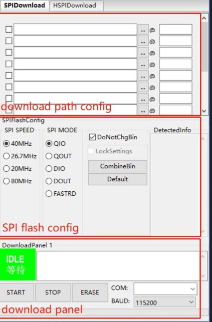
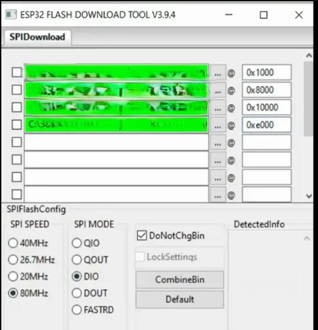
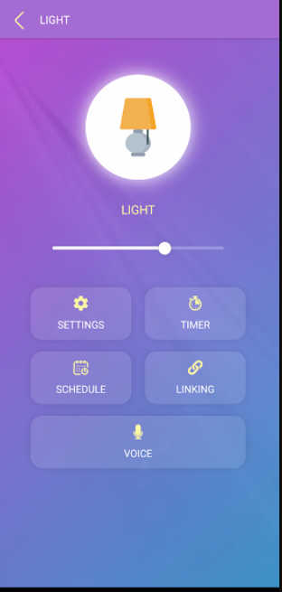

# Cadio Setup & Configuration

This guide explains how the ESP32 was flashed, configured, and controlled using the **Cadio platform** — no manual coding or HTTP required.

---

## 1️⃣ Flashing the ESP32

1. Open **flash_download_tool_3.9.8_w1.exe** on your computer.  
2. Connect your ESP32 board via USB.  
3. Choose your board type (e.g., ESP32).  
4. Select the **bin files** (provided by Cadio).
5. Select the **COM PORT** to which the ESP32 and select the **BAUD RATE**.  
6. Click **START** and wait until it says “FINSIH”.  

> 💡 The firmware used is the official **Cadio ESP32 Dynamic Firmware**, which already includes built-in control and communication logic.

After flashing:
- The ESP32 will restart.
- It will create a **setup Wi-Fi (AP)** named something like `Cadio_ESP32_xxxxxx`.

---

## 2️⃣ Connecting the Device to Wi-Fi (Provisioning)

1. Open the **Cadio mobile app**.  
2. Tap ➕ **Add New Device**.  
3. Choose **ESP32 (Cadio)**.  
4. Connect your phone to the ESP32’s Wi-Fi (config AP).  
5. Enter your **home Wi-Fi SSID and password**.  
6. Wait — once connected, the device will appear in your Cadio dashboard.

✅ The green status dot means your ESP32 is now online and registered in your account.

---

## 3️⃣ Mapping Relays (GPIO Configuration)

Inside the Cadio app or dashboard:

1. Tap your device → **Configure Pins**.  
2. Add **4 ON/OFF Relay** devices.  
3. Map each relay to the corresponding GPIO pins:
   | Relay | ESP32 Pin | Function |
   |--------|------------|----------|
   | Relay 1 | GPIO 25 | Light 1 |
   | Relay 2 | GPIO 26 | Light 2 |
   | Relay 3 | GPIO 27 | Fan 1 |
   | Relay 4 | GPIO 14 | Fan 2 |

4. Save the configuration.

Each relay now appears as a switch in the Cadio dashboard.

---

## 4️⃣ Creating Actions and Voice Commands

Once the relays are configured, you can control them by:
- Tapping the toggle buttons in the Cadio app  
- Using **voice assistants** (Google Assistant / Alexa, if linked)  
- Creating **custom actions**

### Example actions:
| Action Name | Type | Mapped Relay | Description |
|--------------|------|--------------|--------------|
| Turn On Light 1 | Action | Relay 1 | Activates GPIO 25 |
| Turn Off Light 1 | Action | Relay 1 | Deactivates GPIO 25 |
| Turn On Fan | Action | Relay 4 | Activates GPIO 14 |

> 🔊 Voice command example:  
> “Hey Google, turn on Light 1” → triggers Relay 1 ON

---

## 5️⃣ Testing the Setup

Once configured:
1. Tap each relay toggle in the app.  
2. The relay clicks ON/OFF.  
3. The corresponding LED on the relay board should light up.  
4. Verify that the connected loads (lights/fans) work properly.

✅ If all relays respond, your setup is complete!

---

## 6️⃣ Optional Advanced Settings

If you want to add more control features:
- **Schedules / Automations** → Use Cadio’s automation tab (e.g., turn off fan at 10 PM).
  
---

## 7️⃣ Screenshots 

| Screenshot | Description |
|-------------|--------------|
|  | Shows the Flash tool interface |
|  | Shows how an action is configured |
|  | Shows a voice command trigger |

